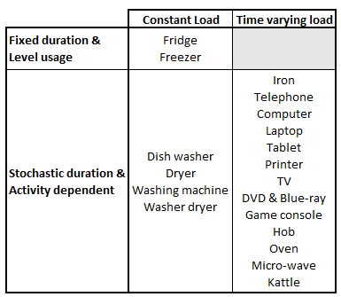

======================
Electric demand  
======================

Electrical demand simulation requires simulating the use domestic
appliances and lights. 

These modules typically consider household occupancy/activity profiles 
and technical characteristics and statistical data for the different 
appliances to simulate daily electric load profile with a 1 min 
time resolution.

Heating the building with a heat pump and operating an electric vehicle 
also contribute to electric demand, however these modules are discussed 
in :doc:`thermal demand and heating system </overview/thermaldemand_overview>` 
and :doc:`mobility </overview/mobility_overview>` sections, respectively. 

Appliance use
----------------

The appliance usage and load modules draws inspiration from CREST_ model, 
developed in excel VBA and presented in [Richardson2010]_ and [McKenna2016]_. 
These modules are compatible with both :ref:`overview_4_States` and 
:ref:`overview_transit_occupancy` simulators. 

These modules address both the initialization and operation phases. 

Installed appliances
~~~~~~~~~~~~~~~~~~~~

At the beginning of a run, the model populates each dwelling 
with a set of appliances.
For the simulation of the German case, demod introduces the following 
changes compared to CREST_: 

- Households are initialized with a set of appliances that is dependent 
  on socio-demographic data, using the dataset from [Destatis2017]_. 
- The full set of available appliances is updated to reflect osbolescence 
  (e.g., answer machine, cassette / CD player) and changes 
  (e.g., tables, game console) in technology.

Appliance categories
~~~~~~~~~~~~~~~~~~~~~~
    
The type of appliance influences the method used to estimate 
its usage and thus its load profile. 
There are three different ways of categorizing appliances.

Based on their load profile:

- *Constant load*: an average load value is assigned to the appliance 
  when it is used.
- *Time varying load*: appliances that have their power consumption 
  varying during an operating cycle. 
  For example, the cycle of a washing machine consists of several stages 
  of heating, washing, draining, spinning, rinsing, 
  which have different power demands.

Based on their usage duration:

- *Fixed duration*: the appliance is always used for the same 
  number of timesteps.
- *Stochastic duration*: the duration is drawn from a random 
  distribution. Example: the TV duration in CREST is drawn from 
  an exponential distribution, and the hot water durations 
  from a set of empirical discrete distributions.

Based on usage patterns:

- *Level usage*: appliances that switch-on and off independently from 
  their usage, such as fridge and freezer.
- *Activity dependent*: appliances directly related to an activity. 
  Therefore, their usage occurs when at least one resident is undertaking 
  the corresponding activity. For example the TV or the oven.
  
In :numref:`appliance-categories`, appliances are reported considering 
these three categorizations. 
    

    
    Appliance categories
    
Activity dependent appliance
~~~~~~~~~~~~~~~~~~~~~~~~~~~~~~
 
As in CREST_, the electricity demand of *activity-dependent* appliances 
is estimated based on the probability that the appliance is turned on, 
which depends on the probability that someone is performing 
the related domestic activity. 
Here is the list of activities that are relevant to the use 
of specific appliances: 

- Watching TV
- Cooking
- Laundry
- Washing(self) / Dressing
- Ironing
- Housecleaning
- **Electronics**
- **Dish Washing**

The two last activities in bold where not present in CREST_ 
but added in demod.

The *Dish Washing* activity is present in the German-time-use_ 
and corresponds to the dishwasher and the sink. 

*Electronics* has been added and accounts for the use of computers, 
laptops, tablets, printers and gaming consoles.

Appliance usage and load simulator
~~~~~~~~~~~~~~~~~~~~~~~~~~~~~~~~~~~~

Demod computes appliance turn-on events following CREST_ approach.

1. first, the activity pdf is multiplied by a calibration scalar, 
   whose value is assigned such that the simulated annual consumption 
   of a device matches a target value, derived from [Frondel2019]_;
2. second, the turn-on event occurs if the probability exceeds a 
   random draw; 
3. when a turn-on event occurs, the duration of the event is 
   also estimated; 
4. finally, the turn-off event occurs at the end of the scheduled 
   duration or when the active occupancy becomes zero if the device 
   depends on the activity. 
   
.. note:: 
    - For appliances that do not depend on active occupancy at all,
      such as the fridge or freezer, step 1 does not consider people 
      activity profile in the dwelling.  
    
    - For appliances with a *fixed duration* step 3 is ignored.
    

Lighting
------------

In demod, two modules are available for lighting simulation. 
Both depend on two parameters:

- The *number of active occupants*, which counts how many people are 
  likely to need light.
- *External radiation* or natural lighting, as human perception of the 
  natural light level within a building is a key factor determining use 
  of artificial lighting.

Fisher's lighting module
~~~~~~~~~~~~~~~~~~~~~~~~~~

This model is presented in [Fisher2015]_, an it computes 
lighting power demand at time t as:

:math:`P_{el,l}(t)=n_{active}(t) \cdot P_{el,l,pp} \cdot 
\frac{I_{g,max}-I_g(t)}{I_{g,max}-I_{g,min}}` 

where :math:`n_{active}(t)` is the number of active occupants 
at a given time, :math:`P_{el,l,pp}` is a constant for accounting 
for light usage per person and :math:`I_{g}(t); I_{g,max}; I_{g,min}` 
are respectively the current irradiation, 
and the boundaries between which the light usage rate increases linearly
between 0 and 1 as the external irradiation decreases.

CREST lighting module
~~~~~~~~~~~~~~~~~~~~~~~~~~

A more advanced model is proposed in [Richardson2009]_. 
This approach is based on on/off events and considers irradiation 
and *effective occupancy* as inputs, which takes into account occupants' 
sharing of lights within the same room. 
It also takes into account any lights that are left on during the day 
and the diversity of households. 
In order to better fit demod to the German case, 
two main modifications are made to Richardson et al. model.

- The number of lights in a housheold is initialized following 
  the approach of [Frondel2019]_. Here, the number of installed buls 
  is generated using a normal distribution :math:`N(25.11,15.92)`.  
- Moreover, the type of light bulbs is defined through a discrete 
  distribution: LED 65%, CFL 25%, and incandescent 10%.
    

 
 .. ~~~~~~~~~~~~~~~~~~~~~~~~~~~~~~~~~ LINKs ~~~~~~~~~~~~~~~~~~~~~~~~~~~~~~~~~

.. _German-time-use: https://www.forschungsdatenzentrum.de/de/haushalte/zve

.. _CREST: https://www.lboro.ac.uk/research/crest/demand-model/ 