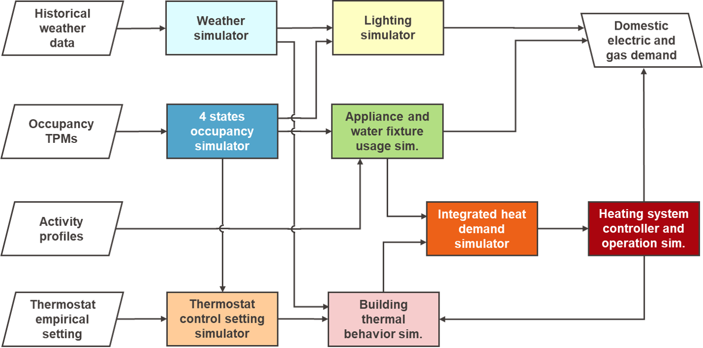

===============
Overview 
===============

In this section demod is presented, showing main functionalities 
and available modules.
By reading this section you should have a general understanding of what demod 
can do, what are the theoretical and empirical foundations of the 
different modules and how to proceed with the design of a domesitc
energy demand model that meets your needs. 

What's demod supposed to do?
----------------------------

Demod has been developed with the overarching aim of providing
a flexible and easily customizable tool for 
simulating domestic energy demand (i.e., electrical and thermal). 

Indeed, you can select numerous household characteristics 
(e.g., appliances, heating system, socio-demographic characteristics) 
or replace entire simulation modules to generate 
suitable energy demand profiles for your research interests. 

.. Activity-based model

In general, demod's modules are based on microsimulation of human behavior. 
In other words, they explicitly take into account household occupancy and 
activity profiles to reconstruct their thermal and electrical demand profiles. 
This allows to simulate energy demand profiles in an integrated and
consistent manner, including dependencies between individual loads 
and obtaining adequate time diversification. 

.. German focus

Currently, demod's modules are parametrized by default using data for Germany. 
It is also possible to select a UK version, which makes use of data 
from the CREST_ model.

The data employed are usually made available 
for other European and non-European countries.
This together with the complete documentation of all the modules
and the data processing methods allows the application of demod 
to contexts other than Germany. 

Examples of application
-----------------------

Thanks to its properties of modularity, scalability and complete transparency, 
demod can be used in various applications: 

- **Direct use** for generating occupancy, activity, thermal and electrical 
  demand profiles with high temporal resolution. 
- Integration of demod-based domestic energy demand model within 
  **co-simulation ecosystems** for the study of larger scale scenarios 
  at district, urban and national level.  
- **Improve, change modules** or **extend** demod's modules to perform 
  cross-analysis and validation of entire models or individual components.  
  

demod's main components
-----------------------

This section presents the modules avialble in demod, their operation, 
their input and output data, and the data needed to parameterize them in case
they are to be used for a specific case study other than those available.
In :numref:'model-framework', a possible demod-based domestic energy demand 
model framework is reported. 

  
  
  Potential configuration for domestic energy demand model using demod
  

.. toctree::
    :maxdepth: 2

    
    occupancy_overview
    electricdemand_overview
    thermaldemand_overview
    mobility_overview
    
.. initialization_overview
  
.. ~~~~~~~~~~~~~~~~~~~~~~~~~~~~~~~~~ LINKs ~~~~~~~~~~~~~~~~~~~~~~~~~~~~~~~~~

.. _German-time-use: https://www.forschungsdatenzentrum.de/de/haushalte/zve

.. _CREST: https://www.lboro.ac.uk/research/crest/demand-model/ 