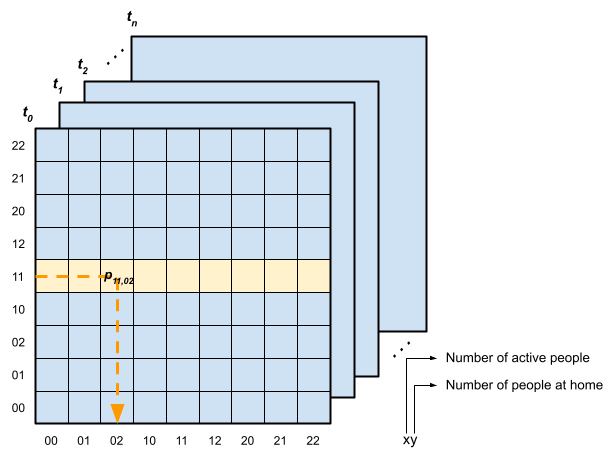

======================
Occupancy and activity
======================

These modules allow to simulate household occupancy and activity behaviour
with a 10 min time resolution.
They uses a Markov chain technique to create stochastic profiles using
transition probability matrices based on time use survey data.

Two alternative modules are currently available in demod:

- :ref:`overview_4_States`
- :ref:`overview_transit_occupancy`

.. _overview_4_States:

4-states occupancy simulator
-----------------------------
:API:  For details about the implementation of
 this simulator you can visit
 :py:class:`~demod.simulators.crest_simulators.Crest4StatesModel`.

:Description: This module is based on a first-order non-homogeneous Markov
    chain model, developed by [McKenna2016]_.
    According to this approach, the occupancy status of each resident is defined
    by the activity status (*active* or *asleep*)
    and location (*home* or *away from home*).
    Therefore, there can be :math:`2^2 = 4` different states:
    (i) at home and active, (ii) at home and asleep, (iii) away from home
    and active, or (iv) away from home and asleep.
    The model is non-homogeneous because the coefficients of the transition
    probability matrix (TPM) change throughout the day with a timestep
    of 10 min.

    This approach has the advantage of ensuring greater accuracy
    in simulating shared family activities such as mealtime.
    However as the number of family members increases the size of TPMs
    grows exponentially making proper parameterization difficult.
    For a household with N members,
    the TPM size can be calculated as :math:`(N + 1)^2`.
    Moreover, this approach does not allow for tracking behavioral profiles
    of individual residents,
    as household occupancy data are provided at aggregate level.

    For illustrative purposes, a graphic representation of the matrix in
    the case of a two-person household is shown in :numref:`TPM`.

    Transition probability matrices for a two-person household

:Availability: This simulator is available for UK and German households.
    However, modeling behavior heterogeneity based on socio-economic groups
    is only available for German households.

.. _overview_transit_occupancy:

Transit occupancy simulator
---------------------------

:API:  For details about the implementation of this simulator you can visit
 :py:class:`~demod.simulators.sparse_simulators.SparseTransitStatesSimulator`.

:Description: This approach extend the :ref:`overview_4_States`
    by distinguishing between 'away for work' and 'away for other'.
    This new version of the model considers three location alternatives and
    thefore, it may be more appropriate for integrating driving
    and charging modules for electric vehicles.

    In this case the size of TPMs is equal to
    :math:`(N + 1) \cdot {3 + N - 1 \choose N}`.
    The first term of the product stands for the number of active/asleep people,
    while the second term corresponds to their location and
    is calculated as the combination with repetition of class N and
    a set of 3 alternatives (i.e., 'home', 'away for work' and 'away for other'),
    :math:`C^{'}_{(3,N)}={3 + N - 1 \choose N}`.

:Availability: This simulator is currently only available for German households.

Other occupancy/activity simulators
------------------------------------

Demod's modular structure allows new simulation modules to be introduced and
tested for performance, such as explit activity simulation
(e.g., see [Yamaguchi2020]_ ).

At the moment these modules are not available, but they are part of the
demod development plan. If you would like to contribute to the
development of new modules, please do not hesitate to contact
the `demod team <demod@groupes.epfl.ch>`_.

.. warning:: For data compatibility reasons, explicit activity modeling requires
             to develop new dedicated modules for simulating electric and
             thermal demand (see
             :doc:`How appliances are simulated </api/appliances>`
             for additional info).

.. ~~~~~~~~~~~~~~~~~~~~~~~~~~~~~~~~~ LINKs ~~~~~~~~~~~~~~~~~~~~~~~~~~~~~~~~~

.. _German-time-use: https://www.forschungsdatenzentrum.de/de/haushalte/zve

.. _CREST: https://www.lboro.ac.uk/research/crest/demand-model/