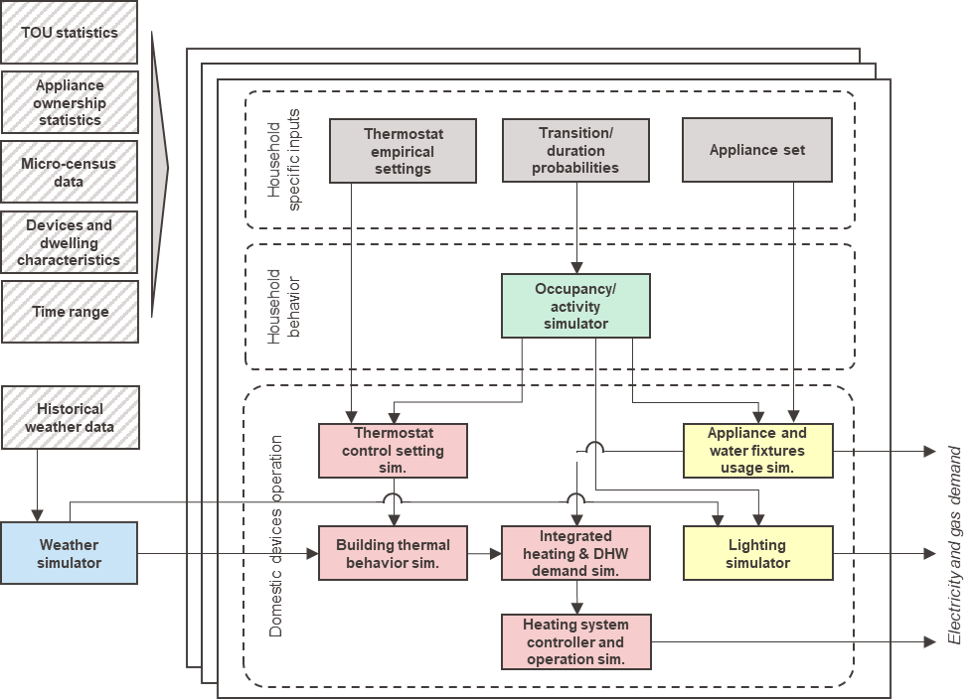
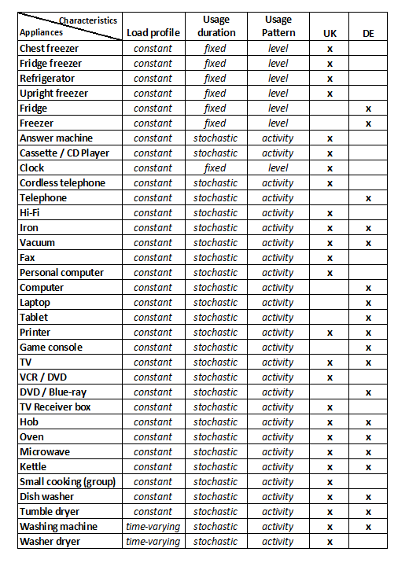

===============
Overview
===============

.. https://docutils.sourceforge.io/docs/user/rst/quickref.html#comments
.. https://docutils.sourceforge.io/docs/user/rst/quickstart.html 

In this section NAME is presented, showing the main functionalities 
and the components that constitute it.

What's NAME supposed to do?
---------------------------

NAME is a bottom-up domestic energy demand model. 

.. Activity-based model

Thanks to an occupancy/activity-based approach, 
NAME allows the integrated simulation of thermal 
and electrical demand profiles for single households. 
The microsimulation of human behavior, 
in terms of occupancy and activity profiles, 
allows to simulate energy demand profiles in a consistent manner, 
including the dependencies between individual loads, 
and obtaining an adequate temporal diversification. 

.. Customizable model

NAME is highly flexible and allows to analyze 
energy demand profiles in widely customizable scenarios 
by modifying several characteristics of the household
(e.g., appliances, heating system, socio-demographic characteristics).

.. German focus

Currently, NAME is parametrized by default using data for Germany. 
It is also possible to select a UK version, which makes use of data 
from the CREST_ model.

The data employed are usually made available 
for other European and non-European countries.
This together with the complete documentation of the model 
and the data processing methods allows the application of NAME 
to contexts other than Germany. 

Examples of application
-----------------------

Thanks to its properties of modularity, scalability and complete transparency, 
NAME can be used in various applications: 

- **Direct use** for generating occupancy, activity, thermal and electrical 
  demand profiles with high temporal resolution. 
- Integration of NAME within **co-simulation ecosystems** for the study
  of larger scale scenarios at district, urban and national level.  
- **Improve, change modules** or **extend** NAME to perform cross-analysis
  and validation of entire models or individual components.  

NAME's main components
-----------------------

This section presents the modules that make up NAME, their operation, 
their input and output data, and the data needed to parameterize them in case
they are to be used for a specific case study other than those available.
In :numref:`model-framework`, NAME's framework is reported.

  
  NAME framework
  

.. warning:: reference the name of the variables within the text

|

Occupancy and activity 
~~~~~~~~~~~~~~~~~~~~~~

This module allows to simulate household occupancy and activity behaviour 
with a 10 min time resolution. 
It uses a Markov chain technique to create stochastic profiles using 
transition probability matrices based on time use survey data.  

Two alternative modules are currently available in NAME:

**4-states occupancy simulator**

    It is based on a first-order non-homogeneous Markov chain model, 
    developed by [McKenna2016]_.
    According to this approach, the occupancy status of each resident is defined 
    by the activity status (*active* or *asleep*) 
    and location (*home* or *away from home*).  
    
    It follows then that there can be :math:`2^2 = 4` different states: 
    (i) at home and active, (ii) at home and asleep, (iii) away from home and active, 
    or (iv) away from home and asleep.
    
    The model is non-homogeneous because the coefficients of the transition 
    probability matrix (TPM) change throughout the day with a timestep 
    of 10 min. 
    This approach has the advantage of ensuring greater accuracy 
    in simulating shared family activities such as mealtime. 
    However as the number of family members increases the size of TPMs 
    grow exponentially making proper parameterization difficult.
    For a household with N members, 
    the TPM size can be calculated as :math:`(N + 1)^2`. 
    Moreover, this approach does not allow for tracking behavioral profiles 
    of individual residents, 
    as household occupancy data are provided at the aggregate level. 
    
    For illustrative purposes, a graphic representation of the matrix in 
    the case of a two-person household is shown in :numref:`TPM`.
      
    .. figure:: OverviewFigures/TPM.PNG
        :width: 400
        :alt: Transition probability matrices
        :align: center
        :name: TPM
        
        Transition probability matrices for a two-person household
            

**Transit occupancy simulator**
  
    This approach extend the 4-state occupancy simulator by distinguishing 
    between 'away for work' (HWH) and 'away for other' (HOH). 
    This new version of the model complicates the parameterization of TPMs 
    as it adds an additional status.
    However, it may be more appropriate if one wants to integrate driving 
    and charging modules for electric vehicles.   
    In this case the size of TPMs is equal to :math:`...`. 
  

**Other occupancy/activity simulators**

    NAME's modular structure allows new simulation modules to be introduced and 
    tested for performance, such as explit activity simulation 
    (e.g., see [Yamaguchi2020]_ ).
    
    .. warning:: In this case, however, it is important to consider the 
                 compatibility of new modules of simulation of the occupancy 
                 and activity, with those of simulation of the electric and
                 thermal demand (see next sections for additional info). 

|

Electric demand  
~~~~~~~~~~~~~~~
The electrical demand model includes appliance and lighting demand models.
These models take as input household occupancy/activity profiles and technical
characteristics and statistical data for the different appliances to simulate
daily electrical load profile with a 1 min time resolution. 

------------

**Appliances**

The appliance usage and load modules draws inspiration from CREST_ model, 
developed in excel VBA and presented in [Richardson2010]_ and [McKenna2016]_. 
These modules are compatible with both *4-states* and *transit occupancy 
simulators*. 

These modules address both the initialization and operation phases. 

*Installed appliances*
    At the beginning of a run, the model populates each dwelling 
    with a set of appliances.
    For the simulation of the German case, NAME introduces the following 
    changes compared to CREST_: 
    
    - Households are initialized with a set of appliances that is dependent 
      on socio-demographic data, using the dataset from [Destatis2017]_. 
    - The full set of available appliances is updated to reflect osbolescence 
      (e.g., answer machine, cassette / CD player) and changes 
      (e.g., tables, game console) in technology.

*Appliance categories*
    The type of appliance influences the method used to estimate 
    its usage and thus its load profile. 
    There are three different ways of categorizing appliances.
    
    Based on their load profile:
    
    - *Constant load*: an average load value is assigned to the appliance 
      when it is used.
    - *Time varying load*: appliances that have their power consumption 
      varying during an operating cycle. 
      For example, the cycle of a washing machine consists of several stages 
      of heating, washing, draining, spinning, rinsing, 
      which have different power demands.
    
    Based on their usage duration:
    
    - *Fixed duration*: the appliance is always used for the same 
      number of timesteps.
    - *Stochastic duration*: the duration is drawn from a random 
      distribution. Example: the TV duration in CREST is drawn from 
      an exponential distribution, and the hot water durations 
      from a set of empirical discrete distributions.
    
    Based on usage patterns:
    
    - *Level usage*: appliances that switch-on and off independently from 
      their usage, such as fridge and freezer.
    - *Activity dependent*: appliances directly related to an activity. 
      Therefore, their usage occurs when at least one resident is undertaking 
      the corresponding activity. For example the TV or the oven.
      
    In :numref:`appliance-categories`, appliances are reported considering 
    these three categorizations. 
    

    
    Appliance categories
    
*Activity dependent appliance* 
    As in CREST_, the electricity demand of *activity-dependent* appliances 
    is estimated based on the probability that the appliance is turned on, 
    which depends on the probability that someone is performing 
    the related domestic activity. 
    Here is the list of activities that are relevant to the use 
    of specific appliances: 
    
    - Watching TV
    - Cooking
    - Laundry
    - Washing(self) / Dressing
    - Ironing
    - Housecleaning
    - **Electronics**
    - **Dish Washing**
    
    The two last activities in bold where not present in CREST_ 
    but added in NAME.
    
    The *Dish Washing* activity is present in the German-time-use_ 
    and corresponds to the dishwasher and the sink. 
    
    *Electronics* has been added and accounts for the use of computers, 
    laptops, tablets, printers and gaming consoles.

*Appliance usage and load simulator* 
    NAME computes appliance turn-on events following CREST_ approach.
    
    1. first, the activity pdf is multiplied by a calibration scalar, 
       whose value is assigned such that the simulated annual consumption 
       of a device matches a target value, derived from [Frondel2019]_;
    2. second, the turn-on event occurs if the probability exceeds a 
       random draw; 
    3. when a turn-on event occurs, the duration of the event is 
       also estimated; 
    4. finally, the turn-off event occurs at the end of the scheduled 
       duration or when the active occupancy becomes zero if the device 
       depends on the activity. 
       
    .. note:: 
        For appliances that do not depend on active occupancy at all, 
        such as the fridge or freezer, step 1 does not consider people 
        activity profile in the dwelling.  
        
        For appliances with a *fixed duration* step 3 is ignored.
    
    
     
------------

**Lighting**

In NAME, two modules are available for lighting simulation. 
Both depend on two parameters:

- The *number of active occupants*, which counts how many people are 
  likely to need light.
- *External radiation* or natural lighting, as human perception of the 
  natural light level within a building is a key factor determining use 
  of artificial lighting.

*Fisher's lighting module*
    This model is presented in [Fisher2015]_, an it computes 
    lighting power demand at time t as:
    
    :math:`P_{el,l}(t)=n_{active}(t) \cdot P_{el,l,pp} \cdot 
    \frac{I_{g,max}-I_g(t)}{I_{g,max}-I_{g,min}}` 
    
    where :math:`n_{active}(t)` is the number of active occupants 
    at a given time, :math:`P_{el,l,pp}` is a constant for accounting 
    for light usage per person and :math:`I_{g}(t); I_{g,max}; I_{g,min}` 
    are respectively the current irradiation, 
    and the boundaries between which the light usage rate increases linearly
    between 0 and 1 as the external irradiation decreases.

*CREST lighting module*
    A more advanced model is proposed in [Richardson2009]_. 
    This approach is based on on/off events and considers irradiation 
    and *effective occupancy* as inputs, which takes into account occupants' 
    sharing of lights within the same room. 
    It also takes into account any lights that are left on during the day 
    and the diversity of households. 
    In order to better fit NAME to the German case, 
    two main modifications are made to Richardson et al. model.
    
    - The number of lights in a housheold is initialized following 
      the approach of [Frondel2019]_. Here, the number of installed buls 
      is generated using a normal distribution :math:`N(25.11,15.92)`.  
    - Moreover, the type of light bulbs is defined through a discrete 
      distribution: LED 65%, CFL 25%, and incandescent 10%.
    
|

Thermal demand and heating system 
~~~~~~~~~~~~~~~~~~~~~~~~~~~~~~~~~
NAME structures the thermal demand and heating system model into three 
components: building thermal model, heating control and domestic hot water 
(see :numref:`thermal-model-framework`).

.. figure:: OverviewFigures/ThermalModelFramework.PNG
    :width: 400
    :alt: The structure of the thermal demand model
    :align: center 
    :name: thermal-model-framework 
    
    The structure of the thermal demand model 
    

*Building thermal model*
    NAME employs simplified lumped-capacitance models
    to simulate building and heating system thermal behaviour.
    
    **4R3C building thermal model** 
    
    The model currently available in NAME is a 4R3C model 
    (see :numref:`CREST-thermal-model`) and it consider the same 
    parameters used in CREST_ for the UK building stock. 
    Here the six configuration of building are reported: detached house,
    semi-detached house and apartment both in the renovated version and not. 
     
    The 4R3C models implements the three thermal capacitances representing
    the thermal masses of the building, indoor air, and heat emitters. 
    While, the four thermal resistences account for heat transfer between 
    (i) walls and indoor air, (ii) walls and outdoor air, 
    (iii) emitters and indoor air, 
    and (iv) air ventilation between indoor and outdoor.
    
    The emitters currently available in NAME are a radiator system. 
    More details on their sizing and characteristics can be found 
    in [McKenna2016]_.   
    
    The parameters for the capacitance and resistences are taken from CREST_, 
    and updated parameters for the German case will be released 
    in future versions. 
    
    .. figure:: OverviewFigures/CRESTBuildingThermalModel.PNG
        :width: 500
        :alt: CREST building thermal model
        :align: center
        :name: CREST-thermal-model  
        
        Building thermal model
        
    .. note::
       A more appropriate model for the German building stock will be 
       provided in future releases.  
        
 .. 6R2C building thermal model
    
.. Alternatively can be selected the model 6R2C, that starting from 
.. the model 5R1C of EN ISO 13790 integrates the resistance (1R) 
.. and the capacity (1C) of the radiator system (see :numref:`ISO13790-thermal-model`).  
    
.. For this model, parameters are currently available for a single apartment
.. configuration, as presented in [Vivian2017]_.

*Domestic hot water*
    Currently NAME simulates domestic hot water demand 
    following the approach developed in [McKenna2016]_.
    
    
*Heating systems*
    Currently NAME implements a set of heating systems, following the 
    approach developed in [McKenna2016]_.
    
    
*Heating controls*
    The heating control model simulates an integrated system 
    with a timer and thermostat (see :numref:`heating-control`). 
    It allows to manage in an integrated way the supply of heating 
    for domestic hot water and space heating, prioritizing the first 
    and ensuring that the heating system works 
    within the recommended operating conditions. 
    
    
    This unit takes the indoor temperature of the building as input and 
    compares it to thermostat setting 
    to estimate the space heating thermal demand. Moreover, thanks to 
    the temperature monitoring of the emitters, 
    the controller avoids that they can reach temperatures higher than 
    the safety temperature of 55 °C.
    
    The thermostat setting is regulated using the approach developed in CREST_,
    which stochastically simulates timer setting based on empirical 
    distributions for weekdays and weekends. 
    
    .. figure:: OverviewFigures/HeatingControls.PNG
        :width: 400
        :alt: Heating control system
        :align: center  
        :name: heating-control 
        
        Heating control system
    
    
.. The second method is inspired by the work [Sovacool2020]_ and
.. attempts to simulate the operation of the heating system by defining 
.. six different usage patterns. These six different patterns aim to give 
.. more relevance to the heterogeneity of behavior of different users in 
.. terms of heating periods and target temperatures.  
  
    
|

Mobility
~~~~~~~~
This section will be released in future versions of NAME.

| 

.. warning:: *Include a last figure to show the compatibility between modules*

|

References
~~~~~~~~~~

.. [Destatis2017]
    Statistisches Bundesamt - Destatis (2017) Laufende wirtschaftsrechnungen 
    ausstattung privater haushaltemit ausgewahlten gebrauchsgutern.   
    
.. [Fisher2015] 
    D. Fischer, A. Härtl, B. Wille-Haussmann (2015) Model for electric load 
    profiles with high time resolution for German households
    
.. [Frondel2019] 
    M. Frondel, S. Sommer, C. Vance (2019) Heterogeneity in German 
    Residential Electricity Consumption: A quantile regression approach    

.. [McKenna2016] 
    E. McKenna, M. Thomson (2016) High-resolution stochastic integrated 
    thermal-electrical domestic demand model

.. [Richardson2009] 
    I. Richardson, M. Thomson, D. Infield, A. Delahunty (2009) Domestic 
    lighting: A high-resolution energy demand model

.. [Richardson2010] 
    I. Richardson, M. Thomson, D. Infield, C. Clifford (2010) Domestic 
    electricity use: A high-resolution energy demand model

.. [Yamaguchi2020] 
    Y. Yamaguchi, N. Prakash, Y. Simoda (2020) Activity-Based Modeling 
    for Integration of Energy Systems for House and Electric Vehicle
 
 
 .. ~~~~~~~~~~~~~~~~~~~~~~~~~~~~~~~~~ LINKs ~~~~~~~~~~~~~~~~~~~~~~~~~~~~~~~~~

.. _German-time-use: https://www.forschungsdatenzentrum.de/de/haushalte/zve

.. _CREST: https://www.lboro.ac.uk/research/crest/demand-model/ 