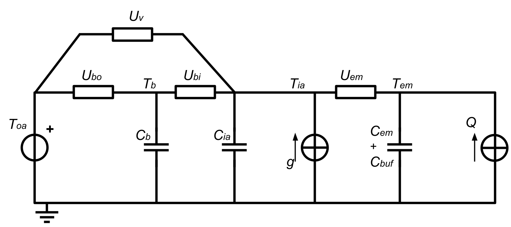
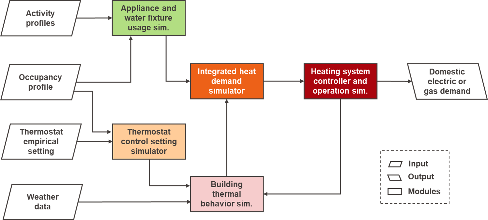

============================================
Heating demand and supply
============================================

Domestic heating demand and supply simulation requires a set of module to
be integrated and jointly executed. 
Below the list of modules available in demod for simulating 
household indoor temperature settings:

- :ref:`overview_CREST_thermostat_setting`
- :ref:`overview_LivingLab_thermostat_setting`

for building thermal behavior:

- :ref:`overview_4R3C_building_thermal_model`

for domestic hot water demand:

- :ref:`overview_CREST_dhw_demand`

for hot water tank thermal behavior:

- :ref:`overview_1R1C_hot_water_tank`

for integrated heat demand for space heating and domestic hot water:

- :ref:`overview_heat_demand`

for heating system controllers:

- :ref:`overview_thermostats`
- :ref:`overview_system_controller`

for heating system operation:

- :ref:`overview_CREST_heating_system`

for integrated heating demand and supply simulation:

- :ref:`overview_FiveModulesHeatingSimulator` 

   
Household indoor temperature settings
-------------------------------------

Two modules are currently available to simulate 
how each household set indoor temperature set point and switch on/off periods
of the heating system. 

.. _overview_CREST_thermostat_setting:

CREST thermostat setting simulator
~~~~~~~~~~~~~~~~~~~~~~~~~~~~~~~~~~~~~~~~~~~

:API: This simulator is currently not available. It will be reliased in future 
  version at 
  :py:class:`~demod.simulators.hetaing_simulators.CRESTcontrols`.

:Description: This module implements the approach developed in CREST_.
  First, indoor air temperature set point is stochastically assigned based on 
  empirical discrete distributions.
  Then, timer setting (i.e., on and off periods) are stochastically simulated
  using a first order Markov chain model, which uses empirical data 
  for weekdays and weekends.  
  If the timer is set on, the heating system keep indoor air temperature 
  within the deadband of :math:`\pm 2^{\circ}C`.

:Availability: This module uses empirical data from CREST, which are derived 
  from a UK study. No equivalent data are currently available for Germany. 

.. _overview_LivingLab_thermostat_setting:

Living Lab thermostat setting simulator
~~~~~~~~~~~~~~~~~~~~~~~~~~~~~~~~~~~~~~~~

:API:  For details about the implementation of
  this simulator you can visit
  :py:class:`~demod.simulators.heating_simulators.VariableThermostatTemperatureSimulator`.

:Description: This module is inspired by [Sovacool2020]_ and
  attempts to simulate heating system control by defining 
  six different usage patterns. These six different patterns aim 
  to give relevance to the heterogeneous behaviour of different households 
  in terms of heating periods 
  (i.e., regularity and dependence on the presence of active residents) 
  and target temperatures. 
  
  The six profiles can be briefly described as follows: 

  * *Cool Conservers*, often adjust temperature to try and cut bills.
  * *Steady and Savvy*, rarely adjust their heating as they are fine with 18-20°C.
  * *Hot and Cold Fluctuators*, often adjust temperature to get comfortable.
  * *On-Demand Sizzlers*, some like it hotter or want to spend more than others in their home.
  * *On-off Switchers*, turn it on and off to try and make sure home is only warm when someone is in.
  * *Toasty Cruisers*,  love feeling cosy and prefer not to put clothes on if they are cold.

:Availability: This module is inspired by empirical observations 
  of an UK-based research [Sovacool2020]_, but makes use of guessed parameters.

:Compatibility: This module is compatible with all heating system simulators 
  that accept exogenous indoor temperature set point profiles as inputs. 

Building thermal behavior
--------------------------

Demod employs simplified lumped-capacitance models
to simulate building and heating system thermal behaviour.

.. _overview_4R3C_building_thermal_model:

Low-order building thermal model (4R3C)
~~~~~~~~~~~~~~~~~~~~~~~~~~~~~~~~~~~~~~~~

:API: For details about the implementation of this simulator you can visit
  :py:class:`~demod.simulators.heating_simulators.BuildingThermalDynamics`.

:Description:
  This module simulates the thermal behavior of the building using an 
  equivalent low-order electric circuit as in CREST_
  (see :numref:`4R3C-building-thermal-model`).
  Six building typology are available: detached house,
  semi-detached house and apartment both in the renovated version and not. 
  
  The name 4R3C refers to three thermal capacitances representing
  the thermal masses of the building :math:`C_{b}`, 
  indoor air :math:`C_{ia}`, 
  and heat emitters and buffer :math:`C_{em} + C_{buf}` and
  the four thermal transmittance account for heat transfer between 
  (i) walls and indoor air :math:`u_{bi}`, 
  (ii) walls and outdoor air :math:`u_{bo}`, 
  (iii) emitters and indoor air :math:`u_{em}`, 
  and (iv) air ventilation between indoor and outdoor :math:`u_{v}`.

  Here are the equivalent equations:

  :math:`T_{ia}^{t+1}=T_{ia}^t + \frac{dt}{C_{ia}}[u_{ia,em}(T_{em}^t-T_{ia}^t)-u_{ia,b}(T_{ia}^t-T_{b}^t)-u_{v}(T_{ia}^t-T_{oa}^t)+g^t]`

  :math:`T_{b}^{t+1}=T_{b}^t + \frac{dt}{C_{b}}[u_{ia,b}(T_{ia}^t-T_{b}^t)-u_{oa,b}(T_{b}^t-T_{oa}^t)]`

  :math:`T_{em}^{t+1}=T_{em}^t + \frac{dt}{C_{em}}[Q^t-u_{ia,em}(T_{em}^t-T_{ia}^t)]`

  The emitters currently available in demod are a radiator system. 
  More details on their sizing and characteristics can be found 
  in [McKenna2016]_.   

:Availability: The parameters for the capacitance and resistences are 
  taken from CREST_, and they refer to the UK building stock.
  An updated parameters for the German case will be released 
  in future versions. 

    Low-order building thermal model 4R3C
        
.. 6R2C building thermal model
    
.. Alternatively can be selected the model 6R2C, that starting from 
.. the model 5R1C of EN ISO 13790 integrates the resistance (1R) 
.. and the capacity (1C) of the radiator system (see :numref:`ISO13790-thermal-model`).  
    
.. For this model, parameters are currently available for a single apartment
.. configuration, as presented in [Vivian2017]_.

Domestic hot water demand
-------------------------

Currently in demod there is a module for simulating the demand for 
domestic hot water. 

.. _overview_CREST_dhw_demand:

CREST domestic hot water demand
~~~~~~~~~~~~~~~~~~~~~~~~~~~~~~~

:API: Simulation of domestic hot water demand is part of
  :ref:`overview_occupancy_based_appliance_usage` and for details 
  about the implementation you can visit
  :py:class:`~demod.simulators.appliance_simulators.SubgroupApplianceSimulator`.

:Description: Currently demod simulates domestic hot water demand 
  following the approach of CREST_, which simulates the use of water fixtures
  in the same way as household appliances: 

  1. first the number of water fixtures in the house is initialized; 
  2. then, the pdf of the activities *washing* or *cooking*
     is multiplied by a calibration scalar, 
     whose value is assigned such that the simulated annual water consumption 
     of each fixture matches a target value;
  3. the water withdrawal event occurs if the probability exceeds a 
     random draw; 
  4. finally, when a water withdrawal event occurs, the  temperature  of  
     hot  water  and  withdrawn  volume  are determined stochastically.

:Availability: This module uses empirical data from CREST, which are derived 
  from a UK study. No equivalent data are currently available for Germany.

Hot water tank thermal behavior
--------------------------------

Currently in demod, a hot water tank can be simulated using the module
:py:class:`~demod.simulators.heating_simulators.BuildingThermalDynamics`
as a component of regular boiler :ref:`overview_system_control`. 
Dedicated modules will be released in future versions. 

.. _overview_1R1C_hot_water_tank:

Low-order hot water tank thermal model (1R1C)
~~~~~~~~~~~~~~~~~~~~~~~~~~~~~~~~~~~~~~~~~~~~~

:API: For details about the implementation of this simulator you can visit
  :py:class:`~demod.simulators.heating_simulators.BuildingThermalDynamics`.

:Description:
  This module simulates the thermal behavior of the hot water tank using an 
  equivalent low-order electric circuit as in CREST_
  (see :numref:`1R1C-hot-water-tank-thermal-model`).
  
  The name 1R1C refers to thermal capacitance representing
  the thermal mass of hot water :math:`C_{tank}` and 
  the thermal resistences of the hot water tank insulation between 
  hot water and indoor air :math:`u_{tank}`. 

  Here is the equivalent equation:

  :math:`T_{dhw}^{t+1}=T_{dhw}^t + \frac{dt}{C_{tank}}[Q_{dhw}-m_{dhw}^{t}cp_{dhw}(T_{dhw}^t-T_{dhw}^{in})-u_{tank}(T_{dhw}^t-T_{ia}^t)]` 

  where :math:`m_{dhw}` is the hot water mass flow,
  :math:`cp_{dhw}` is the thermal capacity of water 
  (:math:`4.2 \: kJ/kg^{\circ}C`) and
  :math:`Q_{dhw}` refers to the heat provided from the heating system.

:Availability: The parameters for the capacitance and resistences are 
  taken from CREST_.

    Low-order hot water tank thermal model (1R1C)

Heat demand
------------------

These modules convert the demand for domestic energy services 
such as indoor thermal comfort and domestic hot water withdrawal 
into heating demand. 

.. _overview_heat_demand:

Integrated heat demand simulator
~~~~~~~~~~~~~~~~~~~~~~~~~~~~~~~~

:API: For details about the implementation of this simulator you can visit
  :py:class:`~demod.simulators.heating_simulators.HeatDemand`.

:Description: This module estimates the heat demand for 
  domestic hot water heating :math:`Q_{dhw}` and 
  space heating :math:`Q_{sh}` in an integrated way. 

  For calculating the target heat demand required to deliver hot water 
  at the appropriate temperature, the module use the following equations,

  :math:`Q_{tank}=\frac{C_{tank}}{dt}(T_{dhw}-T_{tank})`

  :math:`Q_{flow}=m_{dhw}cp_{dhw}(T_{tank}-T_{w,inlet})`

  :math:`Q_{loss}=u_{tank}(T_{tank}-T_{ia})`

  :math:`Q_{dhw}= Q_{tank} + Q_{flow} + Q_{loss}`

  where the heat demand for domestic hot water :math:`Q_{dhw}`
  is estimated as the some of three components:
  (1) :math:`Q_{tank}` the heat required to warm the entire tank up to the 
  target temperature, (2) :math:`Q_{flow}` the heat required to heat up 
  the water requested by the users
  and (3) :math:`Q_{loss}` the thermal losses of the tank.

  To calculate the heat supply required to achieve the comfort temperature 
  of the indoor air, the algorithm aims to keep the temperature 
  of the emitters within the operating range 
  :math:`50^{\circ}C \: \pm 5^{\circ}C`.

  This algorithm is activated when the indoor temperature of the building 
  is equal to or lower than the minimum limit of the the 
  indoor air comfort range :math:`T_{ia,target} - 2^{\circ}C`.
  On the other hand, it is deactivated when the latter reaches the maximum limit
  :math:`T_{ia,target} + 2^{\circ}C`. 
  In this way, typical alternating pattern of the heating system operation
  and oscillating temperature profiles are observed. 

  :math:`Q_{sh}=C_{em}(T_{em,target}-T_{em})+u_{em}(T_{em}-T_{ia})` 
  
.. 2. the second implementation suggest that we target direclty at
..   heating the room and we don't focus at heating only the emitters,
.. :math:`Q_{sh}=C_{ia}(T_{ia,target}-T_{ia})-U_{em}(T_{em}-T_{ia})+(U_{v}+U_{ibo})(T_{ia}-T_{oa})`   

:Compatibility: This module is flexible and allows to use alternative 
  comfort temperature and heating switch on profiles. 
  Once these profiles are generated or empirically measured, 
  they can be given as input to the thermal building model 
  to estimate the heating demand. 

Heating system controllers
--------------------------

This section presents some modules for controlling the heating system
and its components.

.. _overview_thermostats:

Thermostats
~~~~~~~~~~~~~

:API: For details about the implementation of
  this simulator you can visit
  :py:class:`~demod.simulators.heating_simulators.Thermostats`.

:Description: The thermostat monitors the temperature of a thermal component 
  and accordingly sends an ON or OFF signal to the heating system: 
  once the temperature of a component reaches the minimum boundary, 
  which corresponds to its target temperature minus a deadband, 
  the thermostat is set on ON; on the contrary, 
  if the temperature reaches the maximum, the thermostat is set to OFF.

:Compatibility: Any thermal component, for which a target temperature and 
  deadband are defined, can be controlled by this module. 

.. _overview_system_controller:

Heating system controller
~~~~~~~~~~~~~~~~~~~~~~~~~

:API:  For details about the implementation of
  this simulator you can visit
  :py:class:`~demod.simulators.heating_simulators.SystemControls`.

:Description: This module simulates an integrated heating system 
  with a timer and thermostat, checking which controls should be sent to the
  :py:class:`.HeatingSystem`. 
  It allows to manage in an integrated way the supply of heating 
  for domestic hot water and space heating, prioritizing the first 
  and ensuring that the heating system works 
  within the recommended operating conditions.

  This unit takes the indoor temperature of the building as input and 
  compares it to thermostat setting 
  to estimate the space heating thermal demand. Moreover, thanks to 
  the temperature monitoring of the emitters, 
  the controller avoids that they can reach temperatures higher than 
  the safety temperature of 55 °C.

  There are currently two heating system configurations available 
  for which the control system uses two different control methods: 
  'combi' boiler or normal boiler.

  **Combi boiler** or combination boiler is both a water heater 
  and central heating boiler in a single unit.
  Combi boilers heat water directly from the mains 
  when households turn on a tap, 
  so a hot water storage cylinder is not required.

  **Regular boiler** provides heat both for space heating and domestic
  hot water, too. However, the hot water system 
  is connected to a separate hot water cylinder, 
  which allows hot water to be stored 
  without the need for the heating system to be activated 
  every time households turn on a tap.  

:Compatibility: this module is currently compatible with the 
  heating system implemented in :py:class:`.HeatingSystem`.

    
Heating systems
------------------------

Currently demod implements a set of heating systems, following the 
approach developed in [McKenna2016]_.

.. _overview_CREST_heating_system:

CREST heating system
~~~~~~~~~~~~~~~~~~~~~
   
:API:  For details about the implementation of
  this simulator you can visit
  :py:class:`~demod.simulators.heating_simulators.HeatingSystem`.

:Description: It simulates the energy consumption (i.e., gas or electricity)
  of the heating system for providing requested heat demand.

  The algorithm used here is relatively simple and estimates the consumption 
  of electricity or gas :math:`E`on the basis of the heat demand :math:`Q_{th}`, 
  an efficiency coefficient :math:`\eta`, as follows:

  :math:`E= \frac{Q_{th}}{\eta CV}` 

  Then,according to the type of fuel it is estimated the mass flow rate 
  considering the calorific value :math:`CV`,

  :math:`m_{fuel}= \frac{E}{CV}` 

  For more details on the data used and the different system 
  and fuel options available, you can refer to CREST_. 

:Compatibility:    

Integrated heating demand and supply 
-------------------------------------

The modules in this section combine a set of the modules presented above
and simplify their use.
In this way, all links between modules are already implemented 
and only one module needs to be launched to calculate heating demand and supply. 

.. _overview_FiveModulesHeatingSimulator:

CREST five modules heating simulator
~~~~~~~~~~~~~~~~~~~~~~~~~~~~~~~~~~~~

:API:  For details about the implementation of
  this simulator you can visit
  :py:class:`~demod.simulators.heating_simulators.FiveModulesHeatingSimulator`.

:Description: This module estimates domestic heating demand and supply. 
  It is based on the [CREST]_ model, 
  but simplifies the operation of thermostat control by users. 

  As shown in :numref:`CREST5modulesheatingsystem`,
  the following 5 components are integrated in this module:

  * :ref:`overview_CREST_heating_system`:
  * :ref:`overview_system_control`
  * :ref:`overview_heat_demand`
  * :ref:`overview_thermostats`
  * :ref:`overview_4R3C_building_thermal_model` and :ref:`overview_1R1C_hot_water_tank`

:Compatibility:  This simulator is also compatible 
  with external simulated components.

  For instance, the desired indoor temperature can be passed in the
  step method through
  :py:attr:`~demod.utils.cards_doc.Inputs.external_target_temperature`

  CREST integrated heating demand and supply model
  

 
.. ~~~~~~~~~~~~~~~~~~~~~~~~~~~~~~~~~ LINKs ~~~~~~~~~~~~~~~~~~~~~~~~~~~~~~~~~

.. _German-time-use: https://www.forschungsdatenzentrum.de/de/haushalte/zve

.. _CREST: https://www.lboro.ac.uk/research/crest/demand-model/ 