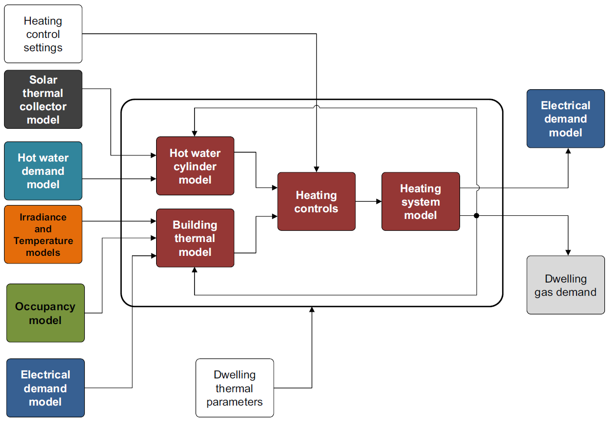
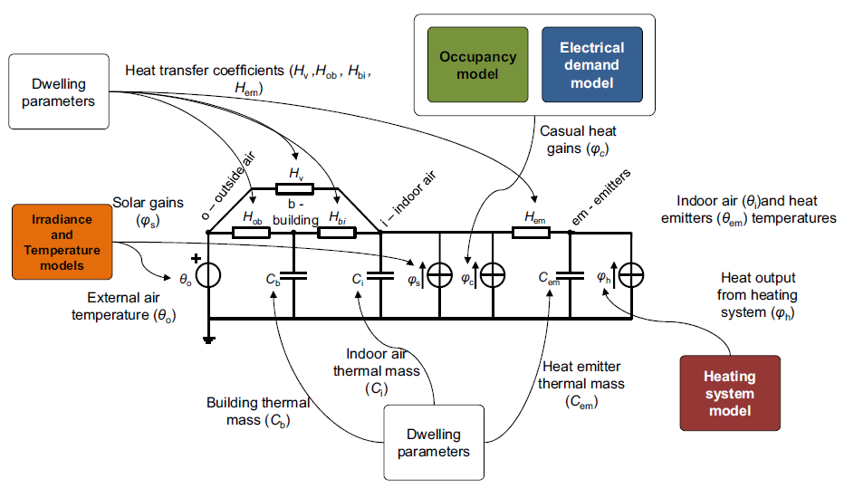
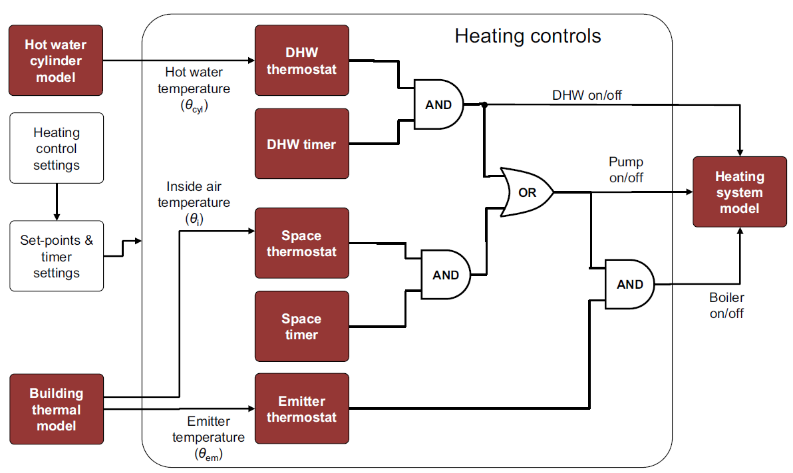

============================================
Thermal demand and heating system 
============================================

NAME structures the thermal demand and heating system model into three 
components: building thermal model, heating control and domestic hot water 
(see :numref:`thermal-model-framework`).

    
    The structure of the thermal demand model 
    

Building thermal model
------------------------

NAME employs simplified lumped-capacitance models
to simulate building and heating system thermal behaviour.

4R3C building thermal model
~~~~~~~~~~~~~~~~~~~~~~~~~~~~

The model currently available in NAME is a 4R3C model 
(see :numref:`CREST-thermal-model`) and it consider the same 
parameters used in CREST_ for the UK building stock. 
Here the six configuration of building are reported: detached house,
semi-detached house and apartment both in the renovated version and not. 
 
The 4R3C models implements the three thermal capacitances representing
the thermal masses of the building, indoor air, and heat emitters. 
While, the four thermal resistences account for heat transfer between 
(i) walls and indoor air, (ii) walls and outdoor air, 
(iii) emitters and indoor air, 
and (iv) air ventilation between indoor and outdoor.

The emitters currently available in NAME are a radiator system. 
More details on their sizing and characteristics can be found 
in [McKenna2016]_.   

The parameters for the capacitance and resistences are taken from CREST_, 
and updated parameters for the German case will be released 
in future versions. 

    
    Building thermal model
    
.. note::
   A more appropriate model for the German building stock will be 
   provided in future releases.  
        
 .. 6R2C building thermal model
    
.. Alternatively can be selected the model 6R2C, that starting from 
.. the model 5R1C of EN ISO 13790 integrates the resistance (1R) 
.. and the capacity (1C) of the radiator system (see :numref:`ISO13790-thermal-model`).  
    
.. For this model, parameters are currently available for a single apartment
.. configuration, as presented in [Vivian2017]_.

Domestic hot water
------------------------

Currently NAME simulates domestic hot water demand 
following the approach developed in [McKenna2016]_.

    
Heating systems
------------------------

Currently NAME implements a set of heating systems, following the 
approach developed in [McKenna2016]_.
    
    
Heating controls
------------------------

The heating control model simulates an integrated system 
with a timer and thermostat (see :numref:`heating-control`). 
It allows to manage in an integrated way the supply of heating 
for domestic hot water and space heating, prioritizing the first 
and ensuring that the heating system works 
within the recommended operating conditions. 

This unit takes the indoor temperature of the building as input and 
compares it to thermostat setting 
to estimate the space heating thermal demand. Moreover, thanks to 
the temperature monitoring of the emitters, 
the controller avoids that they can reach temperatures higher than 
the safety temperature of 55 °C.

The thermostat setting is regulated using the approach developed in CREST_,
which stochastically simulates timer setting based on empirical 
distributions for weekdays and weekends. 

    
    Heating control system

    
.. The second method is inspired by the work [Sovacool2020]_ and
.. attempts to simulate the operation of the heating system by defining 
.. six different usage patterns. These six different patterns aim to give 
.. more relevance to the heterogeneity of behavior of different users in 
.. terms of heating periods and target temperatures.  
  
    

References
------------

.. [Destatis2017]
    Statistisches Bundesamt - Destatis (2017) Laufende wirtschaftsrechnungen 
    ausstattung privater haushaltemit ausgewahlten gebrauchsgutern.   
    
.. [Fisher2015] 
    D. Fischer, A. Härtl, B. Wille-Haussmann (2015) Model for electric load 
    profiles with high time resolution for German households
    
.. [Frondel2019] 
    M. Frondel, S. Sommer, C. Vance (2019) Heterogeneity in German 
    Residential Electricity Consumption: A quantile regression approach    

.. [McKenna2016] 
    E. McKenna, M. Thomson (2016) High-resolution stochastic integrated 
    thermal-electrical domestic demand model

.. [Richardson2009] 
    I. Richardson, M. Thomson, D. Infield, A. Delahunty (2009) Domestic 
    lighting: A high-resolution energy demand model

.. [Richardson2010] 
    I. Richardson, M. Thomson, D. Infield, C. Clifford (2010) Domestic 
    electricity use: A high-resolution energy demand model

.. [Yamaguchi2020] 
    Y. Yamaguchi, N. Prakash, Y. Simoda (2020) Activity-Based Modeling 
    for Integration of Energy Systems for House and Electric Vehicle
 
 
 .. ~~~~~~~~~~~~~~~~~~~~~~~~~~~~~~~~~ LINKs ~~~~~~~~~~~~~~~~~~~~~~~~~~~~~~~~~

.. _German-time-use: https://www.forschungsdatenzentrum.de/de/haushalte/zve

.. _CREST: https://www.lboro.ac.uk/research/crest/demand-model/ 